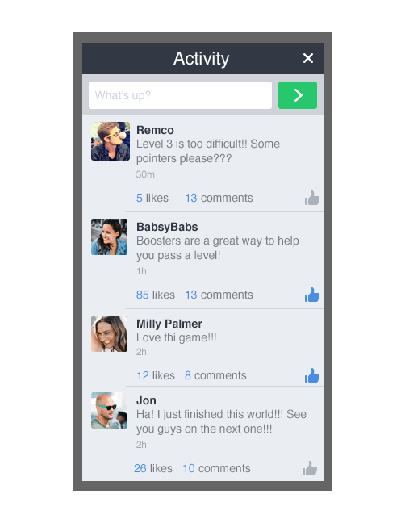
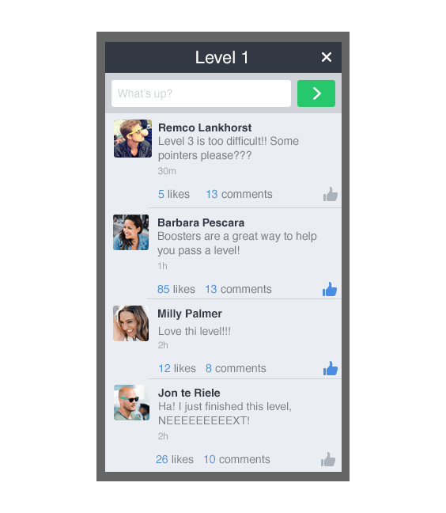
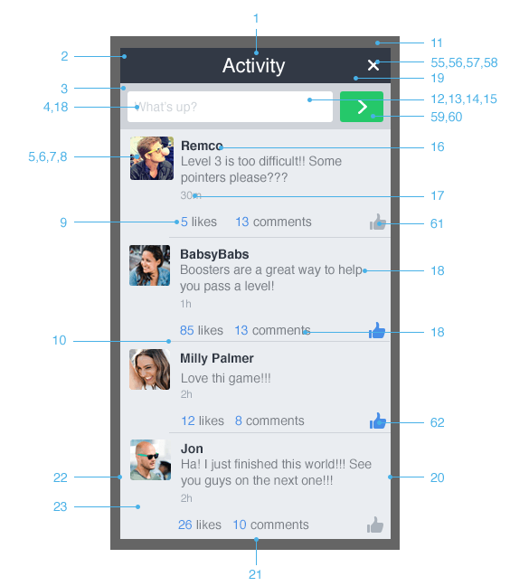
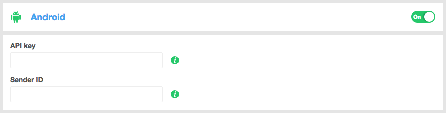
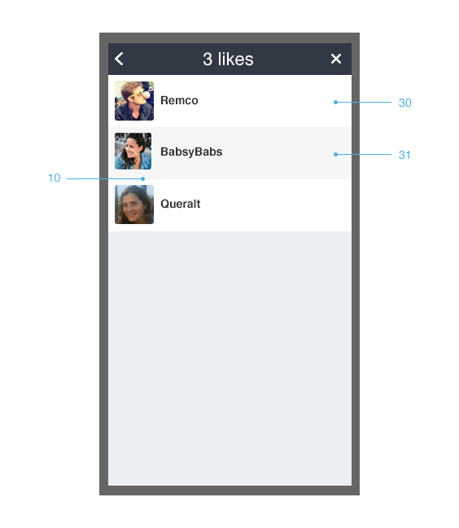
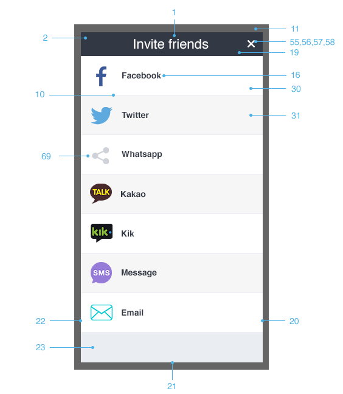
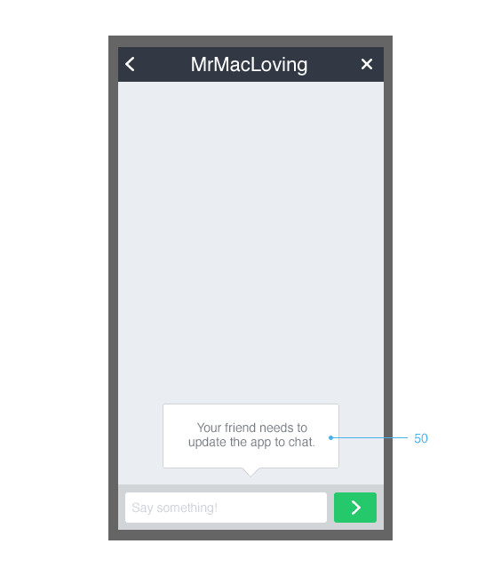

# Getting Started


Build and manage the community within your games with **GetSocial** .

GetSocial provides the whole social layer stack that powers **engagement** , **retention** , **acquisition** and **revenue tools** .


**Features Include:**

* Fully customisable UI
* Player-to-player chat
* Developer-to-player communication
* Segmented and Global Activity Feeds
* Screenshot capture and sharing
* Community Management
* Player Feedback and support
* Smart invites and tracking
* Socially endorsed promotions for in-app purchases
* Socially relevant cross-promotion tools
* Localised to 12 languages
* In-app Notification Center
* Socially triggered push notifications
* And more...


For more information on GetSocial, visit our [website](http://www.getsocial.im/) or [contact us](mailto:info@getsocial.im).


To manage the integration of the GetSocial SDK, [login to your developer account](http://developers.gramble.com).


# Let’s get the integration started


* [Adding the SDK to your game](#adding-the-sdk-to-your-game)
  * [Initialization](#initialization)
  * [Localization](#localization)
* [Activities](#activities)
* [Chat](#chat)
* [Smart Invites](#smart-invites)
* [Notification Center](#notification-center)
* [Push Notifications](#push-notifications)
* [Integration with facebook](#integration-with-facebook)
  * [User Authentication](#user-authentication)
  * [Smart Invites](#smart-invites)
* [Invite and install tracking](#invite-and-install-tracking)
* [Customizing the appearance](#customizing-the-appearance)
  * [Getting the current configuration](#getting-the-current-configuration)
  * [Specifying window width and height](#specifying-window-width-and-height)
  * [Scaling the content](#scaling-the-content)
  * [Specifying the animation](#specifying-the-animation)
  * [Specifying colors](#specifying-colors)
  * [Specifying images](#specifying-images)
  * [Specifying dimensions](#specifying-dimensions)
  * [Specifying text styles](#specifying-text-style)
  * [Using custom fonts](#using-custom-fonts)
  * [UI Reference Table](#ui-reference-table)


# Adding the SDK to your game


Download the GetSocial SDK from [here](https://github.com/getsocial-im/getsocial-android-sdk/archive/master.zip). Now, let's add it to your project.


In **Eclipse** , create a directory called "libs" in your project, if it does not exist already.

Copy the “getsocial-android-sdk.jar” file into the libs directory. 

Right-click on it and then click on ‘Add to Build Path’ in the Build Path submenu.


In **Android Studio** , create a directory called "libs" in your project, if it does not exist already.

Copy the “getsocial-android-sdk.jar” file into the libs directory.

Add the reference to the “getsocial-android-sdk.jar” in the build.gradle.


The GetSocial SDK requires that you build your project with Android Developers Tools (ADT) version 19 or above.


## Initialization


In just a few steps you will be able to have your game GetSocial-ready. Once you have the basics in place, you can easily add other GetSocial features into your game.


First of all you need to modify your AndroidManifest.xml file in order for GetSocial to run correctly, by adding the following permissions.


```xml
<uses-permission android:name="android.permission.ACCESS_NETWORK_STATE" />
<uses-permission android:name="android.permission.INTERNET" />
<uses-permission android:name="android.permission.WRITE_EXTERNAL_STORAGE" />
```


Before using any other functionality, you should first authenticate your game:


```java
GetSocial getSocial = GetSocial.getInstance(getApplicationContext());
getSocial.authenticateGame("AppKey", new GetSocial.OperationObserver()
{
	@Override
	public void onSuccess(String data)
	{
		// game authenticated
	}
	
	@Override
	public void onFailure()
	{
		// game not authenticated
	}
});
```

Your App Key can be found in the GetSocial Developer Portal or obtained from your GetSocial Developers Relations Manager.


The GetSocial SDK should be notified every time the Activity that contains the View(s) that build up your game is paused or resumed.


Here’s how you do it:

```java
@Override
protected void onResume()
{
	super.onResume();

	getSocial.onResume(this);
}

@Override
protected void onPause()
{
	super.onPause();

	getSocial.onPause();
}
```


To make the back button interaction work with the GetSocial SDK UI you also need to override the onBackPressed as follow:


```java
@Override
public void onBackPressed()
{
	if(!getSocial.handleBackButtonPressed())
	{
		super.onBackPressed();
	}
}
```


You can also register a listener to be notified every time one of our views is opened or closed.


```java
getSocial.setOnLayerStateChangedListener(new GetSocial.OnLayerStateChangedListener()
{
	@Override
	public void onOpen()
	{
		//code to handle the opening of a GetSocial View, maybe pause the game if needed.
	}
	
	@Override
	public void onClose()
	{
		//code to handle the closing of a GetSocial View, maybe resume the game if needed.
	}
});
```


## Localization


The GetSocial SDK supports multiple languages. By default the device language is used, to change it you need to call the setLanguage method providing one of the following codes. 

We currently support the following languages:


| <sub>Language   </sub>| <sub>ISO Code   </sub> |
|------------|-------------|
| <sub>Danish     </sub>| <sub>da         </sub> |
| <sub>Dutch      </sub>| <sub>nl         </sub> |
| <sub>English    </sub>| <sub>en         </sub> |
| <sub>French     </sub>| <sub>fr         </sub> |
| <sub>German     </sub>| <sub>de         </sub> |
| <sub>Italian    </sub>| <sub>it         </sub> |
| <sub>Norwegian  </sub>| <sub>nb         </sub> |
| <sub>Portuguese </sub>| <sub>pt         </sub> |
| <sub>Russian    </sub>| <sub>ru         </sub> |
| <sub>Spanish    </sub>| <sub>es         </sub> |
| <sub>Swedish    </sub>| <sub>sv         </sub> |
| <sub>Turkish    </sub>| <sub>tr         </sub> |


```java
getSocial.setLanguage("it");
```


Please note that you can always call this method, but the UI needs to be reloaded to reflect the changes.

# 

# 

# Activities


Showing activities for your game is quite easy


```java
getSocial.open(GetSocial.VIEW_ACTIVITIES);

```


You can also pass a `Map<String, String>` as second argument to specify additional properties. For instance, if you want to show a custom title, you can provide it as follow


```java
Map<String, String> properties = new HashMap<String, String>();
properties.put(GetSocial.PROPERTY_TITLE, "Level 1");
```

Do you need more control on what to show on the Activity Feed or maybe have different Activity feeds per level, per clan or a custom attribute?

[Contact us](mailto:info@getsocial.im) and we will show you how to do it easily.

# Chat

Chat is integrated into your game the moment you integrate the GetSocial SDK. Every time a user taps on another user’s avatar, a chat conversation is started between the two.

You can link to the chat views that enable your users to view their active conversations and also start new conversations with their friends.


```java
getSocial.open(GetSocial.VIEW_CHAT);
```

You can also directly open a chat conversation from user’s avatar within the game using their User ID on supported Social Providers.


```java
Map<String, String> properties = new HashMap<String, String>();
properties.put(GetSocial.PROPERTY_PROVIDER_ID, "facebook");
properties.put(GetSocial.PROPERTY_USER_ID, "0123456789");

getSocial.open(GetSocial.VIEW_CHAT, properties);
```


# Smart Invites

Using Smart Invites users can easily invite their friends to join and play the game. To open the smart invite view you should call:


```java
getSocial.open(GetSocial.VIEW_INVITE);
```

You will see several options to invite friends, depending on what applications you have currently installed on your and which providers you enabled on the GetSocial Developer Portal.


# Notification Center

Activity feed and Chat features are incomplete without having the Notification Center  that provides in-app notifications to users when someone likes or comments on their activities or when they receive chat messages. 


```java
getSocial.open(GetSocial.VIEW_NOTIFICATIONS);
```

It is highly recommended that you link this to a UI element with a notifications count badge. The SDK provides a block that allows getting count of the unread chats and activity notifications.


```java
getSocial.setOnNotificationsChangedListener(new GetSocial.OnNotificationsChangedListener()
{
	@Override
	public void onNotificationsChanged(int numberOfUnreadNotifications, int numberOfUnreadConversations)
	{
		//code to handle changes on Notifications/Conversations counts 
	}
});
```
# 
# Push Notifications


To enable Google Cloud Messaging (GCM) for Android, you will first need to turn on the Google Cloud Messaging Services from [Google's API Console](https://code.google.com/apis/console) page.

1. First select "APIs & auth" from the left-hand navigation and click on "APIs". 
2. Then find "Google Cloud Messaging for Android" in the list and turn it on by clicking the switch in the "Status" column.
3. Finally create a Google API key from the "Credentials" panel. Please use the generated value to obtain a Sender ID in the Google Play Developer Portal for your game.


In order for GetSocial to send push notifications on your behalf, you need to upload the Google API key and the Sender ID in our Developer portal.



You need to add the following permissions to your AndroidManifest.xml to allow the application to receive and display Google Cloud Messaging notifications from GetSocial.

```xml
<uses-permission android:name="android.permission.GET_ACCOUNTS" />
<uses-permission android:name="android.permission.WAKE_LOCK" />
<uses-permission android:name="com.google.android.c2dm.permission.RECEIVE" />
```

This custom permission is also required for Google Cloud Messaging. The permission name is YOUR_PACKAGE_NAME.gcm.permission.C2D_MESSAGE where YOUR_PACKAGE_NAME is the package name declared in your AndroidManifest.xml.

```xml
<permission android:name="YOUR_PACKAGE_NAME.gcm.permission.C2D_MESSAGE" android:protectionLevel="signature" />
<uses-permission android:name="YOUR_PACKAGE_NAME.gcm.permission.C2D_MESSAGE" />
```

The Intent Filter for the action "getsocial.intent.action.NOTIFICATION_RECEIVE" should be added to the activity that integrates the GetSocial SDK.
This GcmBroadcastReceiver will allow your application to register for and receive GetSocial push notifications.

```xml
<application ...>
        <activity
            android:name="YOUR_ACTIVITY">
            <intent-filter>
            	<action android:name="getsocial.intent.action.NOTIFICATION_RECEIVE" />
            	<category android:name="android.intent.category.DEFAULT" />
            </intent-filter>
        </activity>
        <receiver
            android:name="im.getsocial.sdk.gcm.GcmBroadcastReceiver"
            android:permission="com.google.android.c2dm.permission.SEND" >
            <intent-filter>
                <action android:name="com.google.android.c2dm.intent.REGISTRATION" />
                <action android:name="com.google.android.c2dm.intent.RECEIVE" />
                <category android:name="YOUR_PACKAGE_NAME.gcm" />
            </intent-filter>
        </receiver>
</application>
```


# User Authentication
# 
GetSocial SDK needs to integrate with the Game login to enable chat, posting activities, comments, liking activities and install attribution. 

Whenever a user performs an action that requires login, the SDK calls the login request handler which allows the game to show it’s own login UI.
# 

```java
getSocial.setOnLoginRequestListener(new GetSocial.OnLoginRequestListener()
{
	@Override
	public void onLoginRequest()
	{
		// Show Game login UI
	}
});
```
# 
# 
# 
# Integration with Facebook

The GetSocial SDK can easily interact with the Facebook social features using one of the latest versions of the Facebook SDK.


Make sure you follow the [Facebook SDK integration for Android](https://developers.facebook.com/docs/android/getting-started).
## User Authentication

Whenever a user performs an action that requires login, the SDK calls the login request handler which allows the game to show the FB Login UI. You could use FB default UI or implement your own.


```java
getSocial.setOnLoginRequestListener(new GetSocial.OnLoginRequestListener()
{
	@Override
	public void onLoginRequest()
	{
		logInWithFacebook();
	}
});
```

Where logInWithFacebook is the method responsible to open a new Facebook Session.

```java
private List<String> FACEBOOK_PERMISSIONS = Arrays.asList("public_profile", "email", "user_friends");

private void logInWithFacebook()
{
	Session session = Session.getActiveSession();
	
	if(session != null && (session.isOpened() || session.getState().equals(SessionState.CREATED_TOKEN_LOADED)))
	{
		Session.NewPermissionsRequest newPermissionsRequest = new Session.NewPermissionsRequest(this, FACEBOOK_PERMISSIONS);
		session.requestNewReadPermissions(newPermissionsRequest);
	}
	else
	{
		Session.setActiveSession((session = new Session(this)));
		
		Session.OpenRequest openRequest = new Session.OpenRequest(this);
		openRequest.setPermissions(FACEBOOK_PERMISSIONS);
		session.openForRead(openRequest);
	}
}
```

If you are using the Facebook LoginButton, you need to also implement the Session.StatusCallback to get the state changes and sync the GetSocialSDK.

```java
private View initializeFacebookLoginButton()
{
	LoginButton loginButton = new LoginButton(this);
	loginButton.setReadPermissions(FACEBOOK_PERMISSIONS);
	loginButton.setSessionStatusCallback(new Session.StatusCallback()
	{
		@Override
		public void call(Session session, SessionState state, Exception exception)
		{
			FacebookUtils.getInstance().updateSessionState();
		}
	});
		
	return loginButton;
}
```

If you are not using the Facebook LoginButton, make sure you call `FacebookUtils.getInstance().updateSessionState();` whenever you receive an update of the state of the Facebook active session.


## Smart Invites

You can enable the Smart Invites for Facebook by registering our invite plugin.


```java
getSocial.registerPlugin("facebook", new FacebookInvitePlugin(this)
{
	@Override
	public void authenticateUser()
	{
		logInWithFacebook();
	}
});
```


The `loginWithFacebook` method is the same you use to authenticate users with Facebook and we explained before and it is required to be able to authenticate users with Facebook before showing the invite UI.


# 
Invite and install tracking

To allow the GetSocial SDK to track installations you have to copy the following lines in your Manifest file.

```xml
<receiver
    android:name="im.getsocial.sdk.gms.InstallReferrerReceiver"
    android:exported="true">
    <intent-filter>
        <action android:name="com.android.vending.INSTALL_REFERRER" />
    </intent-filter>
</receiver>
```


Be also sure to have the Google Play Services enabled in your Manifest:


```xml
<meta-data
    android:name="com.google.android.gms.version"
    android:value="@integer/google_play_services_version"/>
```


# Customizing the appearance

You are able to customize the GetSocial SDK to match the look and feel of your game. 


## Getting the current Configuration


```java
Configuration configuration = GetSocial.getInstance().getConfiguration();

```


## Specifying window width and height


```java
configuration.setPreferredWindowWidth(320);

configuration.setPreferredWindowHeight(400);

```


If you are also setting a background image, then you don’t need to specify both values. You can specify just one of the dimensions and the other will be calculated to maintain the aspect ratio of the image.

## 

## Scaling the content


The GetSocial UI can be scaled on different sized devices in 2 primary ways:

* **Pixel Perfect** : The UI elements, fonts and margins do not scale depending on the size of the GetSocial UI or device screen. For instance, everything inside the GetSocial UI is the same size on an iPhone 5S, an iPhone 6 Plus or an iPad.
NOTE: This is the default mode.
* **Fixed Ratio** : The UI elements, fonts and margins scale based on the width of the GetSocial UI. For instance, on an iPad with a 600 point wide window, everything looks twice as big as it would on an iPhone with a 300 point wide window. 
NOTE: Since the UI scales are based on the width, if your preferred GetSocial UI window width is wider in landscape, everything would look bigger in landscape.


The scale mode can be set as follows:


```java
configuration.setScaleMode(GetSocial.SCALE_MODE_PIXEL_PERFECT);

configuration.setScaleMode(GetSocial.SCALE_MODE_FIXED_RATIO);

```


Irrespective of the scaling mode, the UI elements, fonts and margins can be scaled up or down by scale factor. The scale factor only affects the contents of the GetSocial UI and not it’s size.


```java
// scaleFactor 2.0 means everything will be twice as big as the default scale

configuration.setScaleFactor(2.0f);

```


The scale mode and factor can be used conditionally to create different styles based on your preference. 


## Specifying the animation


```java

configuration.setAnimationStyle(Property.WINDOW, GetSocial.ANIMATION_FADE);

```


The available animations styles are:

* GetSocial.ANIMATION_SCALE: Animation scales the element In and Out
* GetSocial.ANIMATION_FADE: Animation fades the element In and Out
* GetSocial.ANIMATION_FADE_AND_SCALE: Animation fades and scales the element In and Out


Need a custom animation style? Please [contact us](mailto:info@getsocial.im).


```java
Configuration configuration = GetSocial.getInstance().getConfiguration();

```


## Specifying colors

You can specify colors for backgrounds and borders. Please refer to the Property table to see which ones can be changed. 


```java
configuration.setColor(Property.HEADER, Color.RED);

```


## Specifying images

You can specify images for several elements. Please refer to the Property table to see which ones can be changed. 


```java
configuration.setImagePath(Property.WINDOW, resourcePath + "window.png");

```


If your images are located in the same folder, you can set a base path:


```java
configuration.setBasePathForImages(resourcePath);

```


## Specifying dimensions


```java
configuration.setDimension(Property.HEADER, 38);

```


## Specifying text styles


```java

configuration.setTextStyle(Property.HEADER, Typeface.DEFAULT, 26, 0xffffc000, 0xff371c00, 5f, 0, 1);

```


## Using custom fonts


You can use custom fonts if they are correctly added as assets in your project.


```java
String typeface = resourcePath + "HelveticaNeue.ttf";

configuration.setTextStyle(Property.HEADER, typeface, 26, 0xffffc000, 0xff371c00, 5f, 0, 1);

```


# UI Reference Table


| <sub>**#**                                </sub>| <sub>**Property**                         </sub>| <sub>**TextStyle**                        </sub>| <sub>**Color**                            </sub>| <sub>**Dimension**                        </sub>| <sub>**Drawable**                         </sub> |
|--------------------------------------|--------------------------------------|--------------------------------------|--------------------------------------|--------------------------------------|---------------------------------------|
| <sub>1                                    </sub>| <sub>TITLE_MARGIN_TOP                     </sub>| <sub>                                     </sub>| <sub>                                     </sub>| <sub>X                                    </sub>| <sub>                                     </sub> |
| <sub>2                                    </sub>| <sub>HEADER                               </sub>| <sub>X                                    </sub>| <sub>X                                    </sub>| <sub>X                                    </sub>| <sub>                                     </sub> |
| <sub>3                                    </sub>| <sub>FLOAT                                </sub>| <sub>                                     </sub>| <sub>X                                    </sub>| <sub>                                     </sub>| <sub>                                     </sub> |
| <sub>4                                    </sub>| <sub>HINT                                 </sub>| <sub>X                                    </sub>| <sub>                                     </sub>| <sub>                                     </sub>| <sub>                                     </sub> |
| <sub>5                                    </sub>| <sub>AVATAR_BORDER_SIZE                   </sub>| <sub>                                     </sub>| <sub>                                     </sub>| <sub>X                                    </sub>| <sub>                                     </sub> |
| <sub>6                                    </sub>| <sub>AVATAR_BORDER_COLOR                  </sub>| <sub>                                     </sub>| <sub>X                                    </sub>| <sub>                                     </sub>| <sub>                                     </sub> |
| <sub>7                                    </sub>| <sub>AVATAR_RADIUS                        </sub>| <sub>                                     </sub>| <sub>                                     </sub>| <sub>X                                    </sub>| <sub>                                     </sub> |
| <sub>8                                    </sub>| <sub>DEFAULT_AVATAR                       </sub>| <sub>                                     </sub>| <sub>                                     </sub>| <sub>                                     </sub>| <sub>X                                    </sub> |
| <sub>9                                    </sub>| <sub>LINK                                 </sub>| <sub>X                                    </sub>| <sub>                                     </sub>| <sub>                                     </sub>| <sub>                                     </sub> |
| <sub>10                                   </sub>| <sub>DIVIDER                              </sub>| <sub>                                     </sub>| <sub>X                                    </sub>| <sub>X                                    </sub>| <sub>                                     </sub> |
| <sub>11                                   </sub>| <sub>MODAL                                </sub>| <sub>                                     </sub>| <sub>X                                    </sub>| <sub>                                     </sub>| <sub>                                     </sub> |
| <sub>12                                   </sub>| <sub>INPUT_FIELD                          </sub>| <sub>X                                    </sub>| <sub>X                                    </sub>| <sub>                                     </sub>| <sub>                                     </sub> |
| <sub>13                                   </sub>| <sub>INPUT_FIELD_BORDER_SIZE              </sub>| <sub>                                     </sub>| <sub>                                     </sub>| <sub>X                                    </sub>| <sub>                                     </sub> |
| <sub>14                                   </sub>| <sub>INPUT_FIELD_BORDER_COLOR             </sub>| <sub>                                     </sub>| <sub>X                                    </sub>| <sub>                                     </sub>| <sub>                                     </sub> |
| <sub>15                                   </sub>| <sub>INPUT_FIELD_RADIUS                   </sub>| <sub>                                     </sub>| <sub>                                     </sub>| <sub>X                                    </sub>| <sub>                                     </sub> |
| <sub>16                                   </sub>| <sub>ENTITY_NAME                          </sub>| <sub>X                                    </sub>| <sub>                                     </sub>| <sub>                                     </sub>| <sub>                                     </sub> |
| <sub>17                                   </sub>| <sub>TIMESTAMP                            </sub>| <sub>X                                    </sub>| <sub>                                     </sub>| <sub>                                     </sub>| <sub>                                     </sub> |
| <sub>18                                   </sub>| <sub>CONTENT                              </sub>| <sub>X                                    </sub>| <sub>                                     </sub>| <sub>                                     </sub>| <sub>                                     </sub> |
| <sub>19                                   </sub>| <sub>CONTENT_MARGIN_TOP                   </sub>| <sub>                                     </sub>| <sub>                                     </sub>| <sub>X                                    </sub>| <sub>                                     </sub> |
| <sub>20                                   </sub>| <sub>CONTENT_MARGIN_RIGHT                 </sub>| <sub>                                     </sub>| <sub>                                     </sub>| <sub>X                                    </sub>| <sub>                                     </sub> |
| <sub>21                                   </sub>| <sub>CONTENT_MARGIN_BOTTOM                </sub>| <sub>                                     </sub>| <sub>                                     </sub>| <sub>X                                    </sub>| <sub>                                     </sub> |
| <sub>22                                   </sub>| <sub>CONTENT_MARGIN_LEFT                  </sub>| <sub>                                     </sub>| <sub>                                     </sub>| <sub>X                                    </sub>| <sub>                                     </sub> |
| <sub>23                                   </sub>| <sub>WINDOW                               </sub>| <sub>                                     </sub>| <sub>X                                    </sub>| <sub>                                     </sub>| <sub>X                                    </sub> |
| <sub>24                                   </sub>| <sub>LOAD_MORE_BUTTON_NORMAL              </sub>| <sub>                                     </sub>| <sub>                                     </sub>| <sub>                                     </sub>| <sub>X                                    </sub> |
| <sub>25                                   </sub>| <sub>LOAD_MORE_BUTTON_PRESSED             </sub>| <sub>                                     </sub>| <sub>                                     </sub>| <sub>                                     </sub>| <sub>X                                    </sub> |
| <sub>26                                   </sub>| <sub>CALL_TO_ACTION                       </sub>| <sub>X                                    </sub>| <sub>                                     </sub>| <sub>                                     </sub>| <sub>                                     </sub> |
| <sub>27                                   </sub>| <sub>CALL_TO_ACTION_TEXT_Y_OFFSET_NORMAL  </sub>| <sub>                                     </sub>| <sub>                                     </sub>| <sub>X                                    </sub>| <sub>                                     </sub> |
| <sub>28                                   </sub>| <sub>CALL_TO_ACTION_TEXT_Y_OFFSET_PRESSED </sub>| <sub>                                     </sub>| <sub>                                     </sub>| <sub>X                                    </sub>| <sub>                                     </sub> |
| <sub>29                                   </sub>| <sub>OVERSCROLL (Android only)            </sub>| <sub>X                                    </sub>| <sub>                                     </sub>| <sub>                                     </sub>| <sub>                                     </sub> |
| <sub>30                                   </sub>| <sub>LIST_ITEM_ODD                        </sub>| <sub>                                     </sub>| <sub>X                                    </sub>| <sub>                                     </sub>| <sub>                                     </sub> |
| <sub>31                                   </sub>| <sub>LIST_ITEM_EVEN                       </sub>| <sub>                                     </sub>| <sub>X                                    </sub>| <sub>                                     </sub>| <sub>                                     </sub> |
| <sub>32                                   </sub>| <sub>BADGE                                </sub>| <sub>X                                    </sub>| <sub>                                     </sub>| <sub>                                     </sub>| <sub>X                                    </sub> |
| <sub>33                                   </sub>| <sub>SEGMENTED_CONTROL_BORDER_SIZE        </sub>| <sub>                                     </sub>| <sub>                                     </sub>| <sub>X                                    </sub>| <sub>                                     </sub> |
| <sub>34                                   </sub>| <sub>SEGMENTED_CONTROL_BORDER_COLOR       </sub>| <sub>                                     </sub>| <sub>X                                    </sub>| <sub>                                     </sub>| <sub>                                     </sub> |
| <sub>35                                   </sub>| <sub>SEGMENTED_CONTROL_RADIUS             </sub>| <sub>                                     </sub>| <sub>                                     </sub>| <sub>X                                    </sub>| <sub>                                     </sub> |
| <sub>36                                   </sub>| <sub>SEGMENTED_NORMAL                     </sub>| <sub>X                                    </sub>| <sub>X                                    </sub>| <sub>                                     </sub>| <sub>                                     </sub> |
| <sub>37                                   </sub>| <sub>SEGMENTED_SELECTED                   </sub>| <sub>X                                    </sub>| <sub>X                                    </sub>| <sub>                                     </sub>| <sub>                                     </sub> |
| <sub>38                                   </sub>| <sub>LIST_ITEM_READ                       </sub>| <sub>                                     </sub>| <sub>X                                    </sub>| <sub>                                     </sub>| <sub>                                     </sub> |
| <sub>39                                   </sub>| <sub>LIST_ITEM_UNREAD                     </sub>| <sub>                                     </sub>| <sub>X                                    </sub>| <sub>                                     </sub>| <sub>                                     </sub> |
| <sub>40                                   </sub>| <sub>START_CHAT_BUTTON_NORMAL             </sub>| <sub>                                     </sub>| <sub>                                     </sub>| <sub>                                     </sub>| <sub>X                                    </sub> |
| <sub>41                                   </sub>| <sub>START_CHAT_BUTTON_PRESSED            </sub>| <sub>                                     </sub>| <sub>                                     </sub>| <sub>                                     </sub>| <sub>X                                    </sub> |
| <sub>42                                   </sub>| <sub>PLACEHOLDER_TITLE                    </sub>| <sub>X                                    </sub>| <sub>                                     </sub>| <sub>                                     </sub>| <sub>                                     </sub> |
| <sub>43                                   </sub>| <sub>PLACEHOLDER_CONTENT                  </sub>| <sub>X                                    </sub>| <sub>                                     </sub>| <sub>                                     </sub>| <sub>                                     </sub> |
| <sub>44                                   </sub>| <sub>INVITE_FRIENDS_BUTTON_NORMAL         </sub>| <sub>                                     </sub>| <sub>                                     </sub>| <sub>                                     </sub>| <sub>X                                    </sub> |
| <sub>45                                   </sub>| <sub>INVITE_FRIENDS_BUTTON_PRESSED        </sub>| <sub>                                     </sub>| <sub>                                     </sub>| <sub>                                     </sub>| <sub>X                                    </sub> |
| <sub>46                                   </sub>| <sub>MY_CHAT_NORMAL                       </sub>| <sub>X                                    </sub>| <sub>                                     </sub>| <sub>                                     </sub>| <sub>X                                    </sub> |
| <sub>47                                   </sub>| <sub>MY_CHAT_PRESSED                      </sub>| <sub>X                                    </sub>| <sub>                                     </sub>| <sub>                                     </sub>| <sub>X                                    </sub> |
| <sub>48                                   </sub>| <sub>THEIR_CHAT_NORMAL                    </sub>| <sub>X                                    </sub>| <sub>                                     </sub>| <sub>                                     </sub>| <sub>X                                    </sub> |
| <sub>49                                   </sub>| <sub>THEIR_CHAT_PRESSED                   </sub>| <sub>X                                    </sub>| <sub>                                     </sub>| <sub>                                     </sub>| <sub>X                                    </sub> |
| <sub>50                                   </sub>| <sub>TOOLTIP                              </sub>| <sub>X                                    </sub>| <sub>                                     </sub>| <sub>                                     </sub>| <sub>X                                    </sub> |
| <sub>51                                   </sub>| <sub>BACK_BUTTON_NORMAL                   </sub>| <sub>                                     </sub>| <sub>                                     </sub>| <sub>                                     </sub>| <sub>X                                    </sub> |
| <sub>52                                   </sub>| <sub>BACK_BUTTON_PRESSED                  </sub>| <sub>                                     </sub>| <sub>                                     </sub>| <sub>                                     </sub>| <sub>X                                    </sub> |
| <sub>53                                   </sub>| <sub>BACK_BUTTON_MARGIN_TOP               </sub>| <sub>                                     </sub>| <sub>                                     </sub>| <sub>X                                    </sub>| <sub>                                     </sub> |
| <sub>54                                   </sub>| <sub>BACK_BUTTON_MARGIN_LEFT              </sub>| <sub>                                     </sub>| <sub>                                     </sub>| <sub>X                                    </sub>| <sub>                                     </sub> |
| <sub>55                                   </sub>| <sub>CLOSE_BUTTON_NORMAL                  </sub>| <sub>                                     </sub>| <sub>                                     </sub>| <sub>                                     </sub>| <sub>X                                    </sub> |
| <sub>56                                   </sub>| <sub>CLOSE_BUTTON_PRESSED                 </sub>| <sub>                                     </sub>| <sub>                                     </sub>| <sub>                                     </sub>| <sub>X                                    </sub> |
| <sub>57                                   </sub>| <sub>CLOSE_BUTTON_MARGIN_TOP              </sub>| <sub>                                     </sub>| <sub>                                     </sub>| <sub>X                                    </sub>| <sub>                                     </sub> |
| <sub>58                                   </sub>| <sub>CLOSE_BUTTON_MARGIN_RIGHT            </sub>| <sub>                                     </sub>| <sub>                                     </sub>| <sub>X                                    </sub>| <sub>                                     </sub> |
| <sub>59                                   </sub>| <sub>POST_BUTTON_NORMAL                   </sub>| <sub>                                     </sub>| <sub>                                     </sub>| <sub>                                     </sub>| <sub>X                                    </sub> |
| <sub>60                                   </sub>| <sub>POST_BUTTON_PRESSED                  </sub>| <sub>                                     </sub>| <sub>                                     </sub>| <sub>                                     </sub>| <sub>X                                    </sub> |
| <sub>61                                   </sub>| <sub>LIKE_NORMAL                          </sub>| <sub>                                     </sub>| <sub>                                     </sub>| <sub>                                     </sub>| <sub>X                                    </sub> |
| <sub>62                                   </sub>| <sub>LIKE_SELECTED                        </sub>| <sub>                                     </sub>| <sub>                                     </sub>| <sub>                                     </sub>| <sub>X                                    </sub> |
| <sub>63                                   </sub>| <sub>LOADING_INDICATOR                    </sub>| <sub>                                     </sub>| <sub>                                     </sub>| <sub>                                     </sub>| <sub>X                                    </sub> |
| <sub>64                                   </sub>| <sub>NOTIFICATION_ICON_LIKE               </sub>| <sub>                                     </sub>| <sub>                                     </sub>| <sub>                                     </sub>| <sub>X                                    </sub> |
| <sub>65                                   </sub>| <sub>NOTIFICATION_ICON_COMMENT            </sub>| <sub>                                     </sub>| <sub>                                     </sub>| <sub>                                     </sub>| <sub>X                                    </sub> |
| <sub>66                                   </sub>| <sub>PLACEHOLDER_ACTIVITY                 </sub>| <sub>                                     </sub>| <sub>                                     </sub>| <sub>                                     </sub>| <sub>X                                    </sub> |
| <sub>67                                   </sub>| <sub>PLACEHOLDER_CHAT                     </sub>| <sub>                                     </sub>| <sub>                                     </sub>| <sub>                                     </sub>| <sub>X                                    </sub> |
| <sub>68                                   </sub>| <sub>PLACEHOLDER_NETWORK                  </sub>| <sub>                                     </sub>| <sub>                                     </sub>| <sub>                                     </sub>| <sub>X                                    </sub> |
| <sub>69                                   </sub>| <sub>DEFAULT_INVITE_PROVIDER              </sub>| <sub>                                     </sub>| <sub>                                     </sub>| <sub>                                     </sub>| <sub>X                                    </sub> |














Assets





